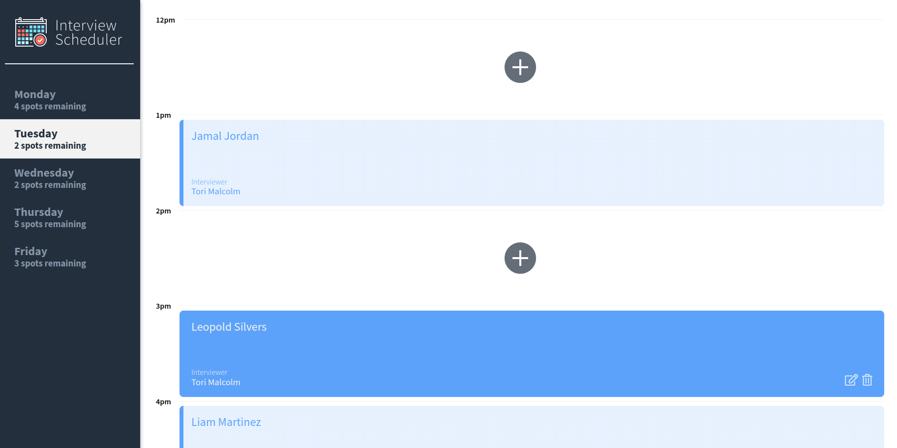

# Interview Scheduler

## Description

The interview scheduler is a single page application that allows students to book interviews with mentors.

## Features


- Choose from weekdays (Monday to Friday) to book an interview, available spots are shown for each day.

- User can book interviews by clicking on the add icon, typing their name and selecting an interviewer from the list.

- User can edit an existing interview by hovering on an appointment and clicking the edit icon.


https://user-images.githubusercontent.com/92469359/193927613-435198bd-af1e-4d39-996e-b21239d9a1a7.mp4


- User can cancel an existing interview by hovering on an appointment and clicking the delete icon, the user will have to confirm before permanently deleting the interview.

## Setup

Install dependencies with `npm install`.

## Running Webpack Development Server

```sh
npm start
```

## Running Jest Test Framework

```sh
npm test
```

## Running Storybook Visual Testbed

```sh
npm run storybook
```
